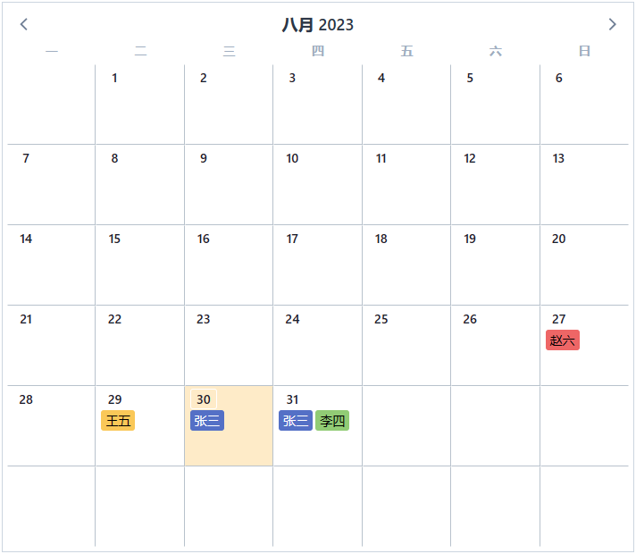

# Selector <i>**(new)**</i>

## Attibutes
### enable selector
`ctrl` & `shift` hold on support

```html
    <v-calendar
        :attributes="attributes"
        is-selector
    />
```
<guide-selector-index />


### containerId

当存在一个以上的多个v-calendar标签时，需通过自定义containerId区分各自的唯一索引，确保命中目标标签 <br />
When there are multiple v-calendar tags, it is necessary to differentiate their unique indexes by customizing the containerId, in order to ensure that the target tag is correctly identified. 

```html
    <v-calendar
        :attributes="attributes"
        is-selector
        :container-id="containerId"
    />
```
```js
    containerId: {
        type: String,
        default: 'month'
    }
```

### check selection covered
```html
    <v-calendar
        :attributes="attributes"
        is-selector
        :check-selection-covered="checkSelectionCovered"
    />
```
```js 
methods: {
    checkSelectionCovered(day) {
        return day.date.getTime() >= day.todayTime
    }
}
```
<guide-selector-index container-id="month1" check />


### check selection oversize
当选区大小超过[checkSelectionOversize^2]时生效，默认20，px

```html
    <v-calendar
        :attributes="attributes"
        is-selector
        :check-selection-oversize="40"
    />
```

<guide-selector-index container-id="month6" :check-selection-oversize="40" />

### context menu event
example: use vue-contextmenujs module

```html
    <v-calendar
        :attributes="attributes"
        is-selector
        :check-selection-covered="checkSelectionCovered"
        @month-context-menu="contextMenu"
    />
```
```js 
methods: {
    contextMenu(selector, e) {
        // { selectedDays } todo
    }
}
```

<guide-selector-index container-id="month2" menu />


### init-days-method
Perform additional logic processing before returning the generated "days" of the month.

```html
    <v-calendar
        :attributes="attributes"
        @init-days-method="dayInit && initDaysMethod"
    />
```

```js
methods: {
    initDaysMethod(days, cb) {
        const last7d = days[days.length - 1 - 6]
        const doms = Array.from(document.getElementsByClassName('custom-calendar'))
        if (last7d && !last7d.inMonth) {
            cb(dropRight(days, 7))
            doms.forEach(dom => dom.style.setProperty('--day-height', 90 + 90 / 5 + 'px'))
        } else {
            doms.forEach(dom => dom.style.setProperty('--day-height', 90 + 'px'))
        }
    }
}
```

<guide-selector-index slot-day container-id="month5" 
        :is-selector="false" dayInit />

## Scoped Slot
### day-content (dayClass <i>**(new)**</i> export default day-content)


```html
    <v-calendar
        :attributes="attributes"
    >
        <template #day-content="{ day, attributes: attrs, dayProps, dayEvents, dayClass }">
            <div :class="dayClass" v-bind="dayProps" v-on="dayEvents">
                <div class="day-label">{{ day.day }}</div>
                <div class="day-attrs">
                    <template v-for="attr in attrs">
                        <span v-if="attr.customData" :key="attr.customData.name" :class="attr.customData.class" :style="attr.customData.style">{{
                            attr.customData.name
                        }}</span>
                    </template>
                </div>
            </div>
        </template>
    </v-calendar>
```
<guide-selector-index slot-day container-id="month3" 
        :is-selector="false" />



### selection-content <i>**(new)**</i>


```html
    <v-calendar
        :attributes="attributes"
        is-selector
    >
        <template #selection-content="{ selector }">
            <div style="width: inherit; height: inherit; background: #0003">SHOW</div>
        </template>
    </v-calendar>
```
<guide-selector-index slot-selection  container-id="month4" />


### 选区与显示器缩放像素换算 Ratio
当显示器缩放时，鼠标的坐标与实际坐标会有所偏差，需要结合window.devicePixelRatio进行换算，这里提供一个ratio的prop，默认为1

```html
props: {
    ratio: {
        type: Number,
        default: 1
    }
}
```